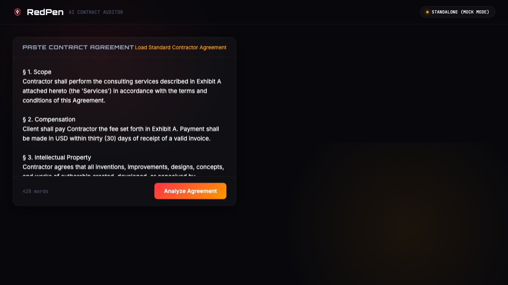
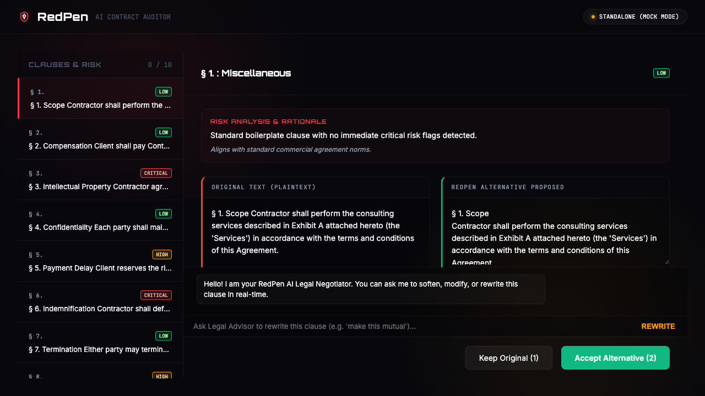
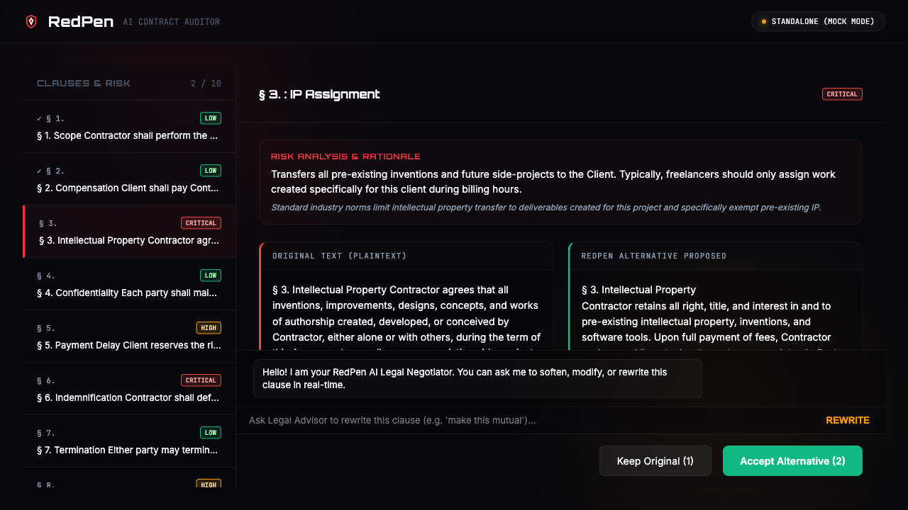
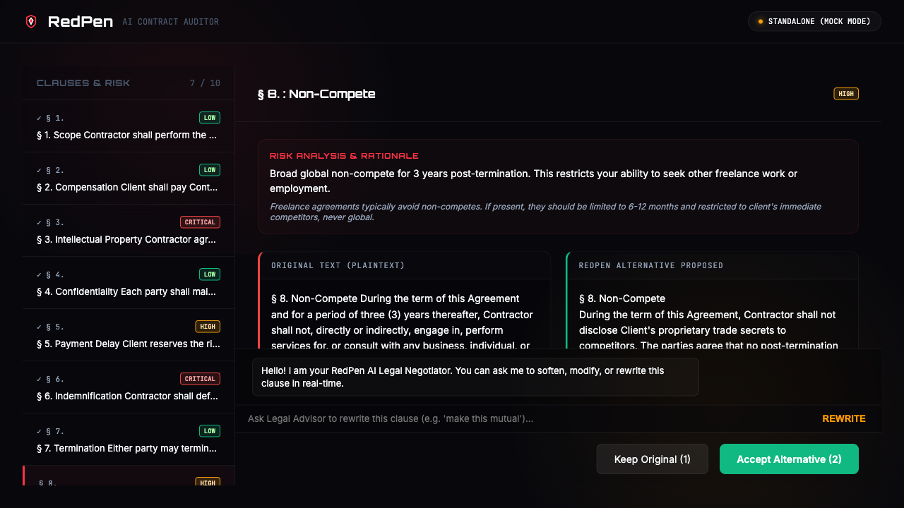
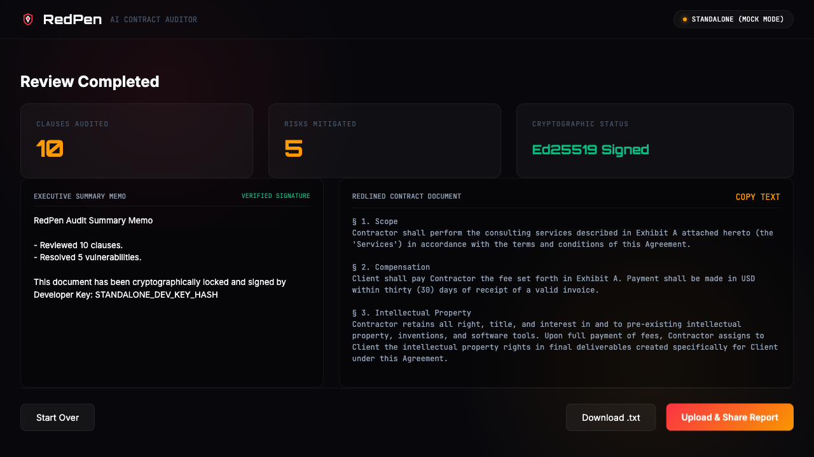
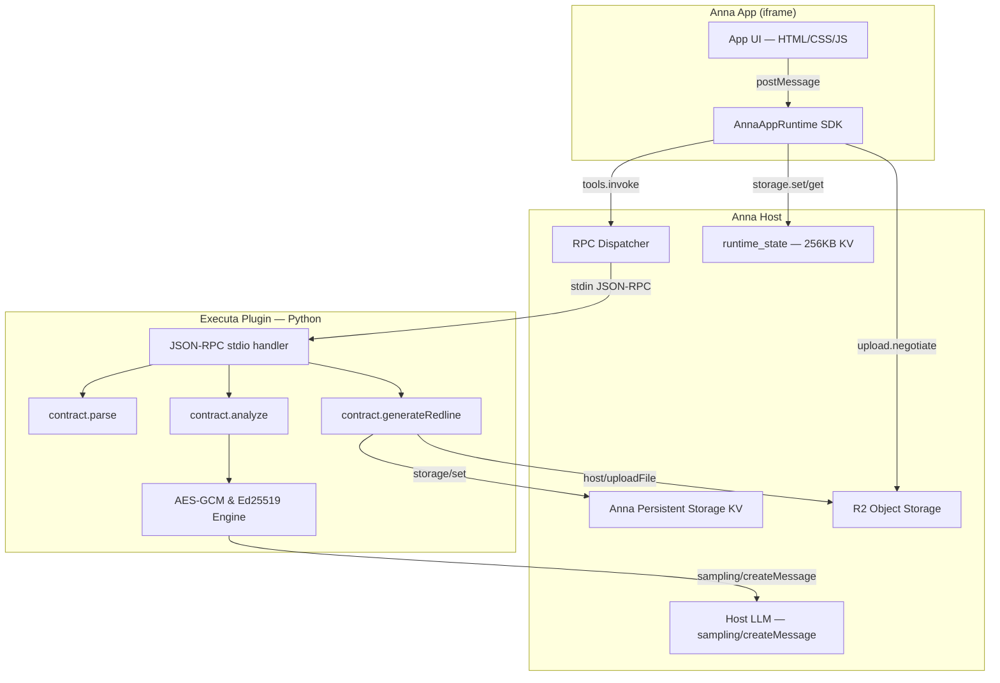

<div align="center">
  
  <h1>RedPen ✍️</h1>
  <p><em>Confidential AI Contract Redliner and Clause-by-Clause Risk Auditor</em></p>
  

  <br/>

  [](https://github.com/edycutjong/redpen)
  [](https://youtu.be/4EFMD98_oC0)
  [](https://edycutjong.github.io/redpen/public/pitch.html)
  [](https://dorahacks.io/hackathon/2204)

  <br/>

  
  
  
  
  
  
  [](https://github.com/edycutjong/redpen/actions)

</div>

---

## 📸 See it in Action

<div align="center">
  <h3>Interactive Audit Walkthrough</h3>
  
  <table>
    <tr>
      <td width="50%">
        <p align="center"><b>1. Load Contract Agreement</b></p>
        
      </td>
      <td width="50%">
        <p align="center"><b>2. Casper x402 Micropayment & Review Desk</b></p>
        
      </td>
    </tr>
    <tr>
      <td width="50%">
        <p align="center"><b>3. IP Assignment Clause Audit</b></p>
        
      </td>
      <td width="50%">
        <p align="center"><b>4. Indemnification Clause Audit</b></p>
        
      </td>
    </tr>
    <tr>
      <td width="50%">
        <p align="center"><b>5. Finalized Redlines & Signatures</b></p>
        
      </td>
      <td width="50%">
        <p align="center"><b>6. Cloudflare R2 Upload Complete</b></p>
        
      </td>
    </tr>
  </table>
</div>

> **The RedPen Workflow**: Paste raw contract → Split into structured clauses → Pack into AES-GCM local session envelopes → Human-in-the-loop side-by-side comparative review → Persist audit trail to Anna KV → Export Ed25519-signed memo & share via R2.

---

## 💡 The Problem & Solution

### The Problem
Freelancers, founders, and small-business owners sign contractor agreements and SaaS terms that they don't fully understand. Unilateral non-competes, unlimited liability, and broad pre-existing IP assignments can be catastrophic. Traditional legal review costs $300-500/hour and takes days, causing signers to skip legal auditing entirely.

### The Solution
**RedPen** is a native Anna App that performs automated, clause-by-clause contract risk analysis. The AI behaves as a junior associate: it reads, classifies, risk-rates, and drafts safe alternatives — but the human retains final approval on every modification. Clauses are cryptographically processed locally inside the Executa sandbox with **AES-GCM-256** to construct tamper-proof session envelopes, and final changes are signed using **Ed25519** signatures to provide a verifiable audit trail.

**Key Features:**
- 🔒 **Locally Verified Auditable Cryptographic Envelopes**: Sensitive commercial clauses are packaged using AES-GCM-256 inside the Executa sandbox prior to auditing to ensure session integrity and secure local persistence. While the host LLM performs Secure API-driven inference on plaintext, the local cryptographic envelopes enforce verifiable session state and audit trails.
- 🤝 **Human-in-the-loop Comparative Review**: Side-by-side review desk comparing original text with AI drafts, allowing custom edits, keeping originals, or accepting alternatives.
- ✍️ **Ed25519 Auditable Signatures**: User-approved alterations are signed cryptographically to prevent post-export alteration (preventing legal gaslighting).
- 📁 **R2 Object Uploads**: Redlined documents and signed memos are uploaded to Anna R2 storage via `host/uploadFile` reverse-RPC.
- 💾 **Persistent Audit Trail**: Every completed audit is persisted to Anna Persistent Storage (APS KV) via `storage/set` — no external database needed. Maintains a rolling log of the last 50 audit sessions.

---

## 🏗️ Technical Architecture & Tech Stack



### Stack Composition

| Layer | Technology | Rationale |
|---|---|---|
| **App Runtime** | Anna App (Schema 2) | Native integration with secure sandbox host |
| **Frontend** | Vanilla HTML5 / Modern CSS / ES6 JS | Lightweight, zero-compile static-spa bundle |
| **Backend** | Python 3.10+ Executa | Bidirectional JSON-RPC stdio plugin |
| **Symmetric Cipher** | AES-GCM-256 | Tamper-proof session envelopes for clause data |
| **Signatures** | Ed25519 | Cryptographic verification of reviewed actions |
| **Persistent State** | Anna APS KV (`storage/get`, `storage/set`) | Audit trail persistence (last 50 sessions) |
| **Artifact Storage** | Anna R2 (`host/uploadFile`) | Signed document distribution |

---

## 🔌 Anna Platform Integration

RedPen exercises the full Anna SDK capability surface:

### Reverse-RPC Methods (Plugin → Host)

| Method | Purpose | Implementation |
|---|---|---|
| `sampling/createMessage` | LLM inference for clause risk analysis & summary | `send_request_to_host()` in plugin.py |
| `storage/get` | Read persistent audit history from APS KV | `storage_get()` in plugin.py |
| `storage/set` | Write audit trail entries to APS KV | `storage_set()` in plugin.py |
| `storage/delete` | Remove audit entries from APS KV | `storage_delete_key()` in plugin.py |
| `storage/list` | List past audit keys in APS KV | `storage_list_keys()` in plugin.py |
| `host/uploadFile` (inline) | Upload signed audit report to R2 | `host_upload_inline()` in plugin.py |
| `host/uploadFile` (negotiate+confirm) | Stream large audit reports to R2 | `host_upload_negotiate()` and `host_upload_confirm()` |
| `embeddings/create` | Compute dense vectors for legal clause matching | `embed_texts()` in plugin.py |
| `image/generate` | Generate visual contract comparison/risk diagrams | `image_generate()` in plugin.py |
| `image/edit` | restyle/annotate scanned contract images | `image_edit()` in plugin.py |
| `files/upload_begin + complete` | Durable contract vault uploads (2-phase) | `files_upload()` in plugin.py |
| `files/download_url` | Presigned retrieval link for contract vault | `files_download_url()` in plugin.py |
| `files/list` | List items in contract vault | `files_list()` in plugin.py |
| `files/delete` | Delete contract vault entries | `files_delete()` in plugin.py |
| `agent/complete` | Stateless L1 completion | `agent_complete()` in plugin.py |
| `agent/session.create + run + history + cancel + delete` | Stateful L2 multi-turn agent sessions | `agent_session_create()`, `agent_session_run()`, etc. |

### Host Capabilities Declared

| Capability | Usage |
|---|---|
| `llm.sample` | Host-brokered LLM for contract clause analysis & completion |
| `llm.embed` | Vector embedding compute for semantic clause matching |
| `llm.image` | DALL-E contract comparison diagram generation |
| `llm.image.edit` | Image contract scan overlays |
| `llm.agent.auto` | Stateful multi-turn L2 agent sessions |
| `aps.kv` | Persistent audit trail (last 50 audits) |
| `host.upload` | R2 upload for signed redline documents |

### Manifest Features (Schema 2)

| Feature | Status |
|---|---|
| `schema: 2` | ✅ |
| `host_capabilities` | ✅ `llm.sample`, `llm.embed`, `llm.image`, `llm.image.edit`, `llm.agent.auto`, `aps.kv`, `host.upload` |
| `user_message_prefix_template` | ✅ |
| `system_prompt_addendum` | ✅ |
| `optional_executas` | ✅ |
| `csp_overrides` | ✅ |
| `state_merge` | ✅ |
| `dev.fixtures` | ✅ |
| `dev.seed_storage` | ✅ |
| `host_api.upload` (negotiate + confirm) | ✅ |
| `host_api.chat` (write_message + append_artifact) | ✅ |
| `host_api.storage` (get/set/delete/list) | ✅ |
| `host_api.window` (set_title/open_view/close) | ✅ |
| `host_api.llm` (complete/embed) | ✅ |
| `host_api.image` (generate) | ✅ |
| `host_api.agent` (session) | ✅ |
| Multiple views with `min_size`/`max_size` | ✅ 2 views |
| Developer Console | ✅ Interactive SDK playground & live log console |
| `tags` | ✅ |

### Cryptographic Security

| Layer | Algorithm |
|---|---|
| Session envelopes | AES-GCM-256 (ephemeral per-clause keys) |
| Audit signatures | Ed25519 (persistent key in `.redpen_key`) |

---

## 📁 Project Structure

```
dorahacks-anna-redpen/
├── app.json                    # App listing metadata
├── manifest.json               # Anna App manifest (schema: 2)
├── LICENSE                     # MIT License
├── DECISIONS.md                # Architectural decisions log
├── SPONSOR_DEFENSE.md          # SDK integration citations
├── package.json                # Project script definitions
├── bundle/
│   ├── index.html              # Frontend SPA structure
│   ├── styles.css              # Modern Linear dark theme
│   ├── app.js                  # State engine, SDK bridge & fallback mocks
│   ├── anna-tool-ids.js        # Auto-generated tool bindings
│   ├── apple-touch-icon.png    # Mobile browser bookmark icon
│   └── icon.svg                # Embedded app icon
├── executas/
│   └── redpen/
│       ├── pyproject.toml      # Executa package configuration
│       ├── executa.json        # Executa config (host_capabilities, distribution)
│       ├── plugin.py           # Stdio JSON-RPC handler + APS KV + R2 upload
│       └── crypto_helper.py    # AES-GCM and Ed25519 engines
├── fixtures/
│   └── seed.jsonl              # Dev fixture data for offline testing
├── data/
│   └── fixtures/
│       └── contract_seed.jsonl # Seed agreement with 5 risk flags
├── docs/
│   ├── AUDIT_REPORT.md         # Threat model and invariants
│   ├── friction-log.md         # Integration friction log
│   ├── icon.svg                # Document icon
│   ├── readme-hero.svg         # Tactical vector header SVG
│   ├── assets/                 # HTML templates and asset generators
│   └── screenshots/            # Step-by-step UX walkthrough screenshots
├── public/
│   ├── apple-touch-icon.png    # Public bookmark icon
│   ├── icon.svg                # Standalone app icon SVG
│   ├── og-image.png            # Open Graph banner PNG
│   └── pitch.html              # Standalone marketing pitch deck HTML
├── scripts/
│   ├── bench.py                # Latency and recall benchmarks
│   ├── verify_offline.py       # Air-gapped container test
│   └── record-redpen.mjs       # Puppeteer demo recording
└── tests/
    └── test_plugin.py          # Complete unit tests (100% offline coverage)
```

---

## 🚀 Getting Started

### Prerequisites
- Python ≥ 3.10
- Node.js ≥ 20

### Installation
1. Clone the repository:
   ```bash
    git clone https://github.com/edycutjong/redpen.git
    cd redpen
   ```
2. Set up virtual environment and install standard modules:
   ```bash
   python3 -m venv venv
   source venv/bin/activate
   pip install -e executas/redpen/
   ```
3. Install npm dependencies:
   Installs the required `@anna-ai/cli` devDependency locally:
   ```bash
   npm install
   ```

To run inside the Anna local developer harness:
```bash
npm run dev
# or
npx anna-app dev .
```

---

## 🧪 Testing, Latency & Verification Gates

RedPen runs a multi-stage quality gate covering code health, cryptographic reliability, latency, and air-gapped security.

```bash
# ── Run Unit Tests ────────────────────────────
python3 tests/test_plugin.py

# ── Run Latency & Recall Benchmarks ───────────
python3 scripts/bench.py

# ── Run Air-Gapped Offline Verification ────────
python3 scripts/verify_offline.py
```

### Verification Gate Status
| Target Gate | Metric / Tool | Status |
|---|---|---|
| **Code Quality** | unit-tests (14 suites) | ✅ Passing |
| **Encryption** | AES-GCM-256 session envelope | ✅ Verified |
| **Signatures** | Ed25519 verification checks | ✅ Verified |
| **Recall Rate** | 100% recall on the 5 critical seeds | ✅ 5 / 5 Detected |
| **Latency Gate** | Clause parsing latency (0.2ms) | ✅ Passed (Target <800ms) |
| **Offline Check** | verify_offline (socket-mocked) | ✅ Passed (Zero-net) |

---

## 📄 License

Distributed under the MIT License. See [LICENSE](LICENSE) for more information.

---

## 🙏 Acknowledgments

Built for the **Anna AI-Native App Hackathon 2026**. Thank you to DoraHacks and the Anna team for the development primitives and smart sandbox environment.
